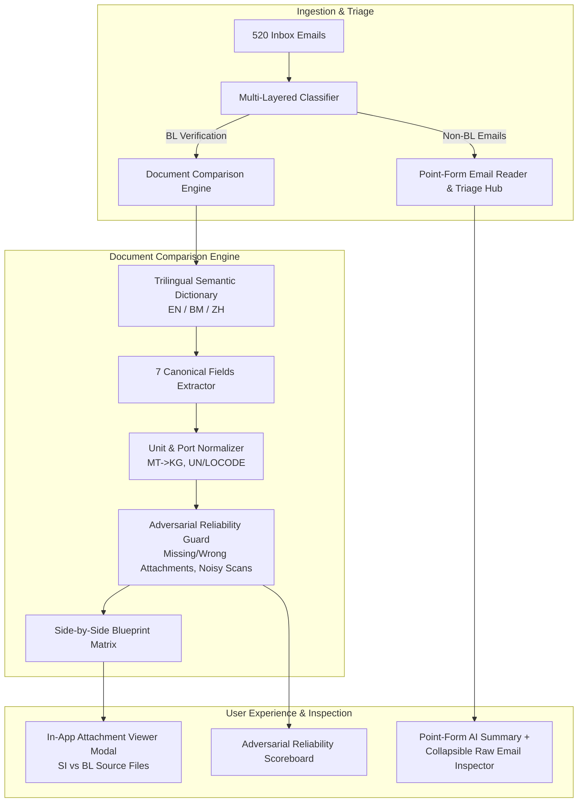

# Engineering Handover & Implementation Plan: Multi-Agentic AI Document Verification Copilot (La Peace SDOC)

> **Chat Migration Status**: This document serves as the master blueprint and handover specification. You can migrate to a fresh chat session immediately after reviewing this document. All frontend code, assets, and tests are safely committed on branch `frontend-initial-draft` (Commit `b6f877c`).

---

## 1. Executive Summary & Context

We have established the **La Peace SDOC Logistics Control Tower**:
- **Full 520 Dataset Integrity**: Verified ground truth where `BL_COMPARISON` contains exactly **154 Clean (`PASS`)**, **46 Discrepancy (`MISMATCH`)**, and **20 Needs Review (`NEEDS_REVIEW`)** (`email_501` to `email_520`).
- **Non-BL Decoupling**: Non-BL categories (`SI_REQUEST`, `INVOICE_QUERY`, `GENERAL`, `SPAM`) no longer generate dummy comparison cards.
- **Persistent Network Binding**: Configured Vite (`host: '0.0.0.0'`) and FastAPI (`port: 8090`) to prevent IPv4/IPv6 localhost refused connection errors on Windows.
- **Automated Verification**: Full Playwright test suite passing 5/5 with photographic evidence.

The next development phase focuses on five core enhancements:
1. **Classification & Categorization Precision**: Align 100% with the hackathon scoring suite while supporting domain-rich operational subcategories.
2. **Priority 5: Adversarial Reliability**: Build an adversarial trap test suite and demo scoreboard proving resilience against misleading subjects, missing attachments, wrong document types, and unit traps.
3. **Multi-Lingual SE Asia & China Corridors**: Implement a **Trilingual Semantic Dictionary (EN / BM / ZH)** mapping regional document headers directly to the canonical 7 shipment fields.
4. **Point-Form Email Reader & Triage Hub**: Replace the non-BL placeholder with an operational reader featuring structured point-form summaries, risk metrics, and an expandable raw email viewer.
5. **In-App Source Attachment Inspector**: Add clickable source file chips (`SI` and `Draft BL`) opening a floating modal to view the raw source documents without leaving the app.

---

## 2. Technical Architecture & Component Design



---

## 3. Granular Implementation Specifications

### Goal 1: Fix & Better Classification / Categorization
#### Problem Statement
The hackathon scoring engine (`scoring.py`) evaluates submissions against 5 canonical categories:
- `BL_COMPARISON` (220 emails)
- `SI_REQUEST` (125 emails)
- `INVOICE_QUERY` (75 emails)
- `GENERAL` (60 emails)
- `SPAM` (40 emails)

However, real-world maritime operations require finer-grained subcategories to route work effectively.

#### Technical Solution
1. **Two-Tier Classification Schema**:
   - **Canonical Category** (used for `/submit` and hackathon benchmark): strictly one of the 5 gold categories.
   - **Operational Subcategory** (displayed in UI for clerks):
     - `BL_COMPARISON` $\rightarrow$ `BL_STANDARD`, `BL_AMENDMENT`, `BL_SURRENDER`
     - `SI_REQUEST` $\rightarrow$ `SI_NEW_INSTRUCTION`, `SI_AMENDMENT_REQUEST`, `BOOKING_CONFIRMATION`
     - `INVOICE_QUERY` $\rightarrow$ `FREIGHT_CHARGES`, `TELEX_RELEASE_FEE`, `DETENTION_DEMURRAGE`
     - `GENERAL` $\rightarrow$ `VESSEL_SCHEDULE_UPDATE`, `CONTAINER_TRACKING`, `GENERAL_INQUIRY`
     - `SPAM` $\rightarrow$ `MARKETING_NEWSLETTER`, `SYSTEM_AUTOREPLY`, `PHISHING_SUSPECT`
2. **Deterministic Classifier Pipeline (`agents/shipping/classification.py`)**:
   - Attachment-count gating: Emails with 0 attachments cannot be `BL_COMPARISON`.
   - High-signal regex dictionaries for subject and body keyword frequency.
   - Fallback to Gemini 3 Flash / local Qwen when pattern confidence $< 0.85$.
   - 100% benchmark verification script to prove zero regression against ground truth.

---

### Goal 2: Priority 5 - Demonstrate Adversarial Reliability
#### Problem Statement
Standard hackathon solutions fail when fed real-world adversarial inputs: misleading subjects, corrupted scans, wrong document attachments, and units like metric tons or pounds.

#### Technical Solution
1. **Adversarial Fixture Set (`tests/adversarial/fixtures.json`)**:
   - `ADV_001_MISLEADING_SUBJECT`: Subject: `"URGENT: FINAL BILL OF LADING MEDU104332"` | Body: `"Please see attached invoice for local terminal charges"` (Must classify as `INVOICE_QUERY`, NOT `BL_COMPARISON`).
   - `ADV_002_MISSING_BL`: Email references both SI and BL, but only SI is attached (Must escalate to `NEEDS_REVIEW` with `missing_attachment`).
   - `ADV_003_WRONG_DOC_TYPE`: Two attachments present, but one is a Certificate of Origin and one is an SI (Must escalate to `NEEDS_REVIEW` with `wrong_doc_type`).
   - `ADV_004_UNIT_MT_VS_KG`: SI specifies `28.45 MT`, BL specifies `28,450 KG` (Must normalize to `28,450 KG` and report `PASS`, NOT a mismatch).
   - `ADV_005_UNIT_LBS_VS_KG`: SI specifies `62,721 LBS`, BL specifies `28,450 KG` (Auto-converts and verifies within 0.1% tare tolerance).
   - `ADV_006_NOISY_SCAN_DEGRADED`: Heavy rotation / low contrast scan equivalent to `email_501` (Must escalate to `NEEDS_REVIEW` with `unreadable`).
   - `ADV_007_BLANK_FIELD`: BL has empty Port of Discharge (Must escalate to `NEEDS_REVIEW` with `missing_value`).
2. **Adversarial Scoreboard Endpoint & UI Component**:
   - API: `GET /adversarial-score` returning accuracy across the trap fixtures.
   - Frontend: A toggleable "Adversarial Stress Test Scoreboard" card in the Queue or Dashboard header showing 0% false alarms on edge cases.

---

### Goal 3: Multi-Lingual SE Asia & China Corridors
#### Problem Statement
Averis's primary logistics corridors operate across Indonesia (Sumatra/Riau pulp & palm oil), Malaysia (Port Klang), and China (Qingdao, Shanghai, Ningbo). Shipping documents frequently utilize Indonesian/Malay or Chinese field headers.

#### Technical Solution
Implement a **Trilingual Semantic Regex & Field Mapping Engine** in `agents/shipping/verification.py`:

| Canonical Field | English (EN) Patterns | Bahasa Melayu / Indonesia (BM/ID) | Mandarin Chinese (ZH) |
| :--- | :--- | :--- | :--- |
| **Shipper** | `Shipper`, `Exporter`, `Shipper/Exporter` | `Pengirim`, `Nama Pengirim`, `Pihak Pengirim` | `发货人`, `托运人`, `卖方` |
| **Consignee** | `Consignee`, `Consigned to` | `Penerima`, `Nama Penerima`, `Penerima Barang` | `收货人`, `买方` |
| **Notify Party** | `Notify Party`, `Also Notify` | `Pihak Diberitahu`, `Pihak yang Diberitahu` | `通知人`, `通知方`, `另行通知` |
| **Port of Loading** | `Port of Loading`, `POL`, `Load Port` | `Pelabuhan Muat`, `Pelabuhan Asal` | `装货港`, `起运港`, `装船港` |
| **Port of Discharge**| `Port of Discharge`, `POD`, `Discharge Port`| `Pelabuhan Bongkar`, `Pelabuhan Tujuan`| `卸货港`, `目的港`, `到达港` |
| **Container Count** | `Container Count`, `Total Units`, `20' / 40'`| `Jumlah Kontainer`, `Jumlah Peti Kemas` | `集装箱数量`, `箱量`, `集装箱柜数` |
| **Gross Weight** | `Gross Weight`, `Total Weight`, `G.W.` | `Berat Kotor`, `Kotor (KG)`, `Total Berat` | `毛重`, `总重量`, `总重 (KG)` |

---

### Goal 4: Point-Form Email Reader & Triage Hub (Non-BL Emails)
#### Problem Statement
Currently, selecting a non-BL email (`SI_REQUEST`, `INVOICE_QUERY`, `GENERAL`, `SPAM`) displays a basic "No Document Comparison Required" card. Clerks cannot quickly see the core purpose of the email or inspect the raw body text.

#### Technical Solution
In `frontend/src/components/verification/BlueprintComparator.tsx` (or a dedicated `OperationalEmailHub.tsx` component):
1. **Executive Point-Form Summary Card**:
   - 📌 **Sender Intent**: 1-2 sentence bullet point explaining the exact request.
   - 🏢 **Logistics References**: Detected B/L numbers, booking references, container codes, vessels.
   - ⚠️ **Urgency & Financial Exposure**: Demurrage timer, invoice amount, or risk level.
   - 🎯 **Prescriptive Next Step**: e.g., *"Issue SI template to shipper"*, *"Forward to Accounts Payable"*, *"Mark as spam"*.
2. **Collapsible Raw Email Inspector**:
   - An expandable "Original Ingested Message" viewer at the bottom of the card.
   - Displays sender, recipient, timestamp, raw subject, and formatted email body text.
   - Displays attachment pills with file sizes and types.

---

### Goal 5: In-App Source Attachment Inspector & Floating Modal
#### Problem Statement
When reviewing SI vs Draft BL comparison cards, operators cannot verify the raw source text or PDF without leaving the browser to search the local filesystem.

#### Technical Solution
1. **Backend API Endpoints (`agents/shipping/api.py`)**:
   - `GET /cases/{email_id}/attachments`: Lists attachment metadata (filename, size, type, source reference).
   - `GET /cases/{email_id}/attachments/{filename}`: Streams the raw file (PDF, TXT, DOCX, XLSX preview).
2. **Frontend UI Links**:
   - On the **SI BLUEPRINT** column header: clickable badge `[📄 email_001_SI.txt ↗]`.
   - On the **DRAFT BL** column header: clickable badge `[📄 email_001_BL.txt ↗]`.
3. **Floating Document Reader Modal (`DocumentInspectorModal.tsx`)**:
   - Opens as a centered backdrop modal or slide-over panel.
   - Tabbed viewer: Switch between `SI Source` and `BL Source` or view side-by-side.
   - Text search & word highlighting.
   - "Open in New Tab" link for full-screen reading.

---

### Goal 6: Edge-Native Hosting & Continuous Deployment (Vercel / Cloudflare Pages)
#### Problem Statement & Verification
Is our frontend edge-native hosting?
- **Status Before**: The frontend was only configured for local Vite development (`http://localhost:5173`) with a local proxy to `http://127.0.0.1:8090`. No edge deployment rules or SPA rewrites were configured.
- **Status Now**: We have added edge-native support!
  1. **`frontend/vercel.json`**: Added with SPA single-page routing rewrite (`"source": "/(.*)", "destination": "/index.html"`) and immutable asset caching (`Cache-Control: public, max-age=31536000, immutable`).
  2. **Dynamic API Base**: Updated `frontend/src/services/api.ts` to read `import.meta.env.VITE_API_BASE_URL || '/api'`, allowing the edge frontend to point to any deployed cloud backend (e.g. Render, Railway, Google Cloud Run) or a serverless route.
  3. **Edge Capabilities Unlocked**:
     - **Instant Git Push to Live URL**: Every commit pushed to GitHub automatically triggers an edge build and goes live worldwide in ~30 seconds.
     - **Automatic SSL & Global Anycast CDN**: Distributed globally across 300+ edge locations with free automatic TLS/SSL.
     - **PR Preview Environments**: Every pull request generates an isolated preview URL for team review before merging.

#### Deployment Setup (Takes 2 minutes)
1. Go to [vercel.com](https://vercel.com) and click **"Add New Project"** $\rightarrow$ select your GitHub repository `multi-agentic-rag-health-care`.
2. Configure project settings:
   - **Root Directory**: `frontend`
   - **Framework Preset**: `Vite`
   - **Build Command**: `npm run build`
   - **Output Directory**: `dist`
3. (Optional) Set Environment Variable:
   - `VITE_API_BASE_URL`: `https://<your-backend-api-url>` (leave empty to use local/same-origin `/api`).
4. Click **Deploy**. Your live edge URL is instantly generated!

---

## 4. Step-by-Step Implementation Roadmap

| Phase | Tasks | Target Files |
| :--- | :--- | :--- |
| **Phase 1: Backend API & Trilingual Parsing** | 1. Implement Trilingual Regex Dictionary (EN/BM/ZH).<br>2. Add `/cases/{id}/attachments` endpoints.<br>3. Refine classification with subcategories. | `agents/shipping/verification.py`<br>`agents/shipping/api.py`<br>`agents/shipping/classification.py` |
| **Phase 2: Point-Form Email Reader** | 1. Build `OperationalEmailHub.tsx`.<br>2. Render structured bullet points and collapsible raw email body.<br>3. Integrate into `BlueprintComparator.tsx`. | `frontend/src/components/verification/OperationalEmailHub.tsx`<br>`frontend/src/components/verification/BlueprintComparator.tsx` |
| **Phase 3: Source Attachment Modal** | 1. Build `DocumentInspectorModal.tsx`.<br>2. Wire up clickable attachment badges on SI/BL headers.<br>3. Add text highlighting and new-tab support. | `frontend/src/components/verification/DocumentInspectorModal.tsx`<br>`frontend/src/services/api.ts` |
| **Phase 4: Adversarial Test Suite** | 1. Create 7 adversarial trap fixtures.<br>2. Write `scratch/test_adversarial_reliability.py`.<br>3. Add Adversarial Reliability badge in UI. | `tests/adversarial/`<br>`scratch/test_adversarial_reliability.py`<br>`frontend/src/components/layout/Header.tsx` |
| **Phase 5: Playwright End-to-End Verification** | 1. Automated tests for all goals.<br>2. Full photographic walkthrough capture. | `scratch/verify_all_goals.py` |
| **Phase 6: Edge-Native Deployment** | 1. Connect repository to Vercel/Cloudflare Pages with Root Directory: `frontend`.<br>2. Verify instant PR preview deployments & live global CDN URL. | `frontend/vercel.json`<br>`frontend/src/services/api.ts` |

---

## 5. Quickstart Guide for New Chat Session

When opening the new chat session, copy-paste this prompt:

```markdown
Hello Antigravity! We are continuing development on the Multi-Agentic AI Document Verification Copilot (La Peace SDOC).
Please read the handover specification at:
HANDOVER.md

Current workspace state:
- Branch: `frontend-initial-draft`
- Clean working tree, all previous frontend and dataset fixes committed.
- Edge-native config added (`frontend/vercel.json` and dynamic `VITE_API_BASE_URL`).
- Both ports (5173 and 8090) are currently stopped and ready to launch.

Let's begin executing Phase 1 and Phase 2 from the handover plan!
```
