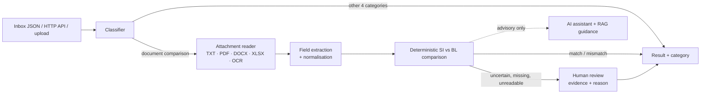
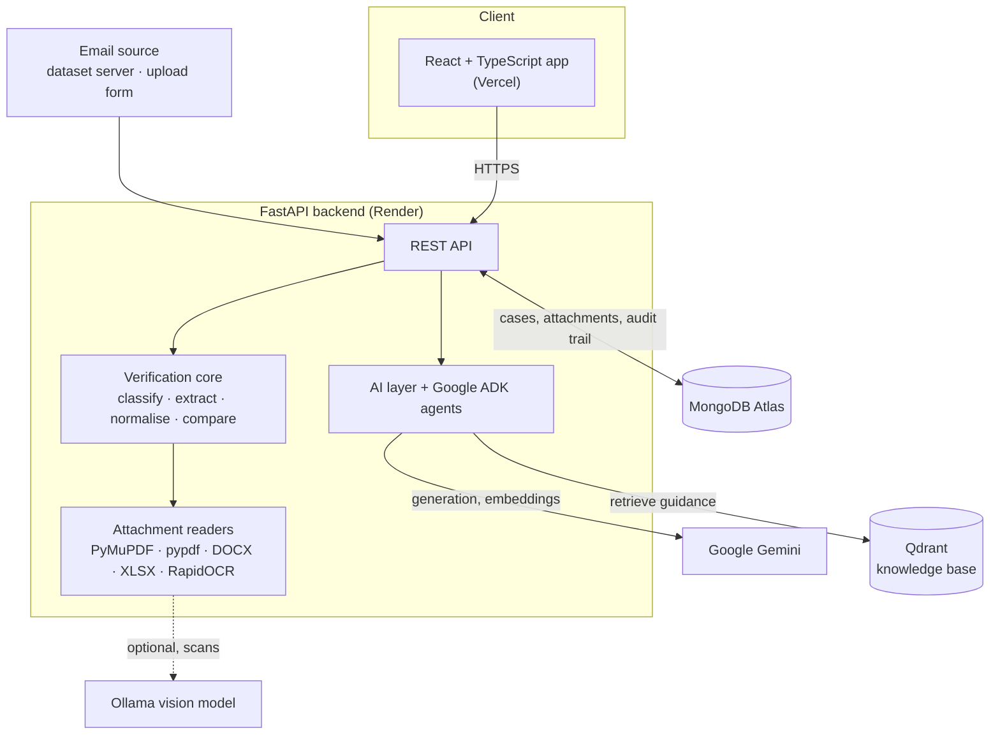

# La Peace SDOC — Multi-Agentic AI Document Verification

> From a shipping team's inbox to a clear discrepancy report. Every email is classified; for document-check requests the system compares a **Shipping Instruction (SI)** with a **draft Bill of Lading (BL)**, shows exactly what differs, and hands anything it cannot decide dependably to a person — with the evidence and the reason.

Built for the SDOC shipping-document hackathon challenge. The UI is deployed on Vercel and talks to a FastAPI backend on Render (the first request can take 15–50 s while the free-tier backend wakes up).

**Contents:** [The challenge](#the-challenge) · [What we built](#what-we-built) · [Results](#results) · [How it works](#how-it-works) · [Technical architecture](#technical-architecture) · [Implementation details](#implementation-details) · [Quick start](#quick-start) · [Configuration](#configuration) · [API](#api) · [Reproduce the score](#reproduce-the-score) · [Tests](#tests) · [Repository layout](#repository-layout) · [Deployment notes](#deployment-notes) · [Challenges we faced](#challenges-we-faced) · [Known limitations](#known-limitations) · [Future roadmap](#future-roadmap)

## The challenge

A shipping operations team gets requests to check documents, prepare new shipping instructions, invoice questions, updates and spam — all in one inbox.

1. **Finding the right emails takes time.** A missed document request never reaches the checking step.
2. **Manual comparison is repetitive and error-prone.** Shipper, consignee, ports, containers and weight must match across two documents.
3. **The same information looks different.** "Port of Loading" vs "Load Port", `22,000 KG` vs `22 MT`, PDFs vs Word vs scans.

The system must classify, extract, compare the **seven fields** (shipper, consignee, notify party, port of loading, port of discharge, container count, gross weight in kg), and **ask for help instead of guessing** when it cannot be sure.

## What we built

- **Rule-based classifier** for the five email categories, using subject, body and attachment signals.
- **Reader for TXT, PDF, DOCX and XLSX**, with OCR for scanned pages and an optional vision-model cross-check.
- **Deterministic comparison engine** that normalises labels, ports, units and party names, and reports only *real* mismatches — plus a "Differences ignored" list so reviewers can see false alarms that were avoided.
- **Human-in-the-loop review**: every uncertain case is escalated with a reason, the source evidence and both readings; a reviewer confirms or corrects it and the report is updated with an audit trail. Failures are visible and retryable.
- **Evidence viewer**: click any field to see the exact SI and BL source text, page and coordinates.
- **AI assistant** (Google Gemini / ADK): case summaries, chat, a manager agent with RAG guidance, and proposal-only workflow actions (draft correction email, accept-as-false-alarm, targeted re-read). Nothing is sent or saved without explicit confirmation.
- **React web app** with inbox, filters, side-by-side comparison, dark mode, and an operations panel to upload a case, process the inbox, retry or delete.

## Results

Measured on the organisers' local self-evaluation endpoint (`POST /submit`), all 520 emails, deterministic pipeline (no LLM needed for the verdict). It is a development aid, not the final assessment.

| Measure | Result |
|---|---|
| **Final score** (30% classification · 20% comparison · 50% end-to-end) | **0.932** |
| Classification accuracy / macro-F1 | 0.825 / 0.948 |
| Comparison: exact match | 0.98 |
| Comparison: defect precision / recall | 1.00 / 0.91 |
| Escalation recall / precision | 0.90 / 0.82 |
| End-to-end success | 42 of 46 |

- **Classification:** SI requests (125/125), invoice queries (75/75), general messages (60/60) and spam (40/40) are all correct. The gap is in document-comparison emails — see [known limitations](#known-limitations).
- **Escalation:** of the 20 cases that should reach a person, missing attachment 5/5, wrong document type 5/5, missing value 5/5, unreadable scan 3/5; the system flagged 22 cases in total.
- **Reproduce it** with the commands in [Reproduce the score](#reproduce-the-score).

## How it works



**Design principles**

- **The deterministic verifier is the authority.** Status and defect fields come from code. The LLM and the RAG guidance explain and suggest; they never change a verdict (the manager-review endpoint is tested to leave the saved report untouched).
- **Cheap-first routing.** Rules resolve the clear fields; only genuinely ambiguous ones (for example near-identical company names) get an advisory LLM diagnosis. The UI shows how many fields were resolved by rules and the estimated LLM cost.
- **Escalate, don't guess.** Reasons: `missing_attachment`, `wrong_doc_type`, `unreadable`, `missing_value`, `ambiguous_field`. An extraction problem is never reported as a discrepancy.
- **Independent readers agree or escalate.** For scans, OCR (RapidOCR) and an optional local vision model (Ollama) are compared field by field; disagreement goes to a human with both readings visible.
- **Untrusted text stays untrusted.** Email and document text is scanned for instruction-like content (prompt injection) and flagged; it never overrides the verdict.
- **RAG with citations.** A Qdrant knowledge base (`agents/tools/knowledge/data.md`, Gemini embeddings) supplies field aliases, unit rules and review guidance. Citations show the matching section, its source and relevance — and only appear for cases that need them.

## Technical architecture

### System overview



In local development the browser talks to Vite on `:5173`, which proxies `/api` to the backend on `:8090`; the sample dataset is served by a Docker container on `:8080`.

### Layers

| Layer | Responsibility | Where |
|---|---|---|
| Presentation | Inbox, side-by-side comparison, evidence viewer, AI assistant, operations panel | `frontend/src` |
| API | REST endpoints, upload validation, orchestration of a case from email to report | `agents/shipping/api.py` |
| Verification core | Classification, field extraction, normalisation, SI-vs-BL comparison, escalation decisions | `agents/shipping/verification.py` |
| Reading | Turn TXT / PDF / DOCX / XLSX / scans into text **with page and coordinates** | `agents/shipping/attachments.py`, `dataset.py` |
| AI (advisory) | Summaries, discrepancy rulings, ambiguity diagnosis, chat, proposal-only actions | `agents/shipping/ai.py`, `actions.py`, `agents/tools/agents/` |
| Knowledge | Embed, store and retrieve review guidance | `agents/tools/functions/`, `agents/tools/knowledge/` |
| Persistence | Case store abstraction with MongoDB and filesystem implementations | `agents/storage.py` |

### One email, end to end

1. The **dataset adapter** loads the email record from a static folder or an HTTP server; an upload goes through `POST /verify`.
2. The **classifier** assigns one of the five categories. Anything other than a document-comparison request is finished here.
3. The **attachment reader** produces text plus per-line spans (attachment, page, coordinates, reading method).
4. **Extraction** finds the seven fields, keeps the source line as evidence, and records a confidence per field.
5. **Normalisation and comparison** run in code, with the SI as the reference. Equivalent differences are recorded as *ignored*; real ones as *defects*.
6. If a field is missing, unreadable or genuinely ambiguous, the case becomes **NEEDS_REVIEW** with a reason instead of a verdict.
7. The report is saved to **MongoDB**; the AI layer adds an advisory summary, and on first opening a mismatch a per-field ruling.
8. A reviewer can **confirm or correct** the report; the correction is stored with an audit event.

### What a stored report contains

```text
email_id, category, status (OK | MISMATCH | NEEDS_REVIEW | UNPROCESSED), review_reason, defect_fields
differences            { field: { si, bl } }                    only the fields that really differ
ignored_differences    [ { field, reason } ]                    label / format / unit differences we did NOT flag
documents.{si,bl}      attachment, fields, evidence, evidence_details (page, coordinates, method),
                       confidence, reader_fields + reader_agreement (OCR vs vision)
routing_telemetry      fields resolved by rules vs sent to the LLM, latency, estimated cost
prompt_injection_*     instruction-like text found in the email or documents
ai_analysis, verifier  advisory only
review_decisions, correction_history, audit_events, created_at, updated_at
```

### Key decisions

- **Deterministic core, advisory AI.** The verdict is reproducible and testable; the LLM can only add explanations.
- **Everything optional degrades gracefully.** No Qdrant: the guidance panel says so. No LLM: the deterministic report is still complete. No OCR packages: scans are escalated as unreadable rather than guessed.
- **Two swappable abstractions.** `DatasetAdapter` (static folder or HTTP server) and `CaseStore` (MongoDB or filesystem) keep the core independent of where data comes from and goes.
- **State lives in MongoDB.** Cases and uploaded attachments are stored there, so the evidence viewer works on a hosted backend whose local disk is temporary.
- **Trust boundaries.** Email and document text is untrusted (scanned for prompt injection, never followed); AI actions are proposal-only and need explicit confirmation; IDs and filenames are sanitised and uploads are capped at 20 MB.

### Tech stack

| Layer | Technology |
|---|---|
| Frontend | React 19, TypeScript, Vite 8, Tailwind CSS 4 (hosted on Vercel) |
| Backend | Python, FastAPI, Uvicorn (hosted on Render) |
| Agents / LLM | Google ADK, Google Gemini; optional Ollama for local models |
| Retrieval | Qdrant vector store, Gemini embeddings |
| Documents | pypdf, PyMuPDF, pypdfium2, python-docx, openpyxl |
| OCR | RapidOCR (default), optional Ollama vision model, Tesseract as a fallback |
| Storage | MongoDB Atlas (cases, attachments); filesystem store for tests |

## Implementation details

### Classification

An ordered rule set in `classify_email`: spam signals first, then automated billing notices (filed as general), invoice queries, new-SI requests, and finally document-comparison requests (subject patterns, or both SI and BL referenced with attachments). The result carries a confidence and a plain-language rationale. Emails that only ask for the draft BL to be sent are detected separately (`is_document_chase`).

### Reading documents

| Format | How it is read |
|---|---|
| TXT | Read directly |
| PDF | PyMuPDF words grouped into lines, each with **page and bounding box**; falls back to pypdf text; if there is no text layer, **RapidOCR** on pages rasterised with pypdfium2 (Tesseract as a further fallback) |
| Scans (optional) | An Ollama vision model reads the same pages; both readings are kept per field |
| DOCX / XLSX | Paragraphs and tables / workbook rows converted to text |

### Extraction and evidence

Each field has a set of label patterns that cover the variants seen in the data (`Port of Loading`, `Load Port`, `POL`, `Gross Wt (kgs)`, …), including labels on one line with the value on the next and multi-line party blocks (name plus address). Fields outside the seven (HS code, B/L number, …) are ignored, so they cannot create false alarms. Every extracted value keeps its source line, attachment, page and coordinates, which is what the evidence viewer highlights.

### Normalisation rules

| Field | Rule | Example |
|---|---|---|
| Shipper, consignee, notify party | Compare the company name (first line), ignoring case, punctuation and spacing; the address is kept as evidence | `Acme Ltd.` = `ACME LTD` |
| Ports | Compare the port name; a trailing UN/LOCODE in brackets is dropped, and "Pelabuhan" is read as "Port" | `MOMBASA, KENYA` ≠ `TUTICORIN, INDIA` even though both carry `(KEMBA)` |
| Container count | First number in the text | `3 x 40'HC` → `3` |
| Gross weight | Converted to kg: MT/tonne × 1000, lb × 0.45359237, thousands separators and OCR comma/dot slips handled | `22,000 KG` = `22 MT` |
| Missing values | Blank, `???`, `TBA`, `TBC`, `N/A` count as **missing**, never as a value | — |

### Comparison and escalation

| Outcome | When |
|---|---|
| `OK` | All seven fields match after normalisation (equivalences are listed under "Differences ignored") |
| `MISMATCH` | At least one field differs and both values were read reliably; only the differing fields are reported, SI value beside BL value |
| `NEEDS_REVIEW` | `missing_attachment`, `wrong_doc_type`, `unreadable`, `missing_value`, or `ambiguous_field` |
| `UNPROCESSED` | Processing failed; the case stays visible and `POST /cases/{id}/retry` re-runs it |

A near-identical party or port name (similarity ratio ≥ 0.85 or edit distance ≤ 3) is **not** decided by a rule: it becomes `ambiguous_field` and goes to a person, because it could equally be an OCR slip or a genuinely different company.

### Cheap-first routing and the AI layer

Rules settle every clear field. Only ambiguous fields get an advisory LLM diagnosis (OCR distortion, formatting/alias, or genuine mismatch), at roughly 150 tokens per field. The report records how many fields were resolved by rules, the latency, and an estimated cost against a full-document baseline, and the UI shows it. Model output is parsed tolerantly (Markdown fences and truncated JSON are handled), and every AI call can fail without affecting the verdict.

### RAG guidance and citations

- **Ingestion:** `data.md` is split with semantic chunking, embedded with Gemini, and stored in Qdrant with deterministic point IDs.
- **Which cases get citations:** only comparison emails that need a decision — mismatches and the five review reasons. Clean matches and other categories skip retrieval entirely.
- **Selecting them:** retrieved chunks are split into headed paragraphs, scored against field-specific terms, de-duplicated, and cut to at most two citations, each with its section title, source and relevance. Built-in field rules are shown separately, so nothing that was not retrieved is labelled as retrieved.

### Agents (Google ADK)

`root_agent` has tools for ingesting documents, retrieving knowledge, running the verification and inspecting one email, and three sub-agents: **retrieval**, **shipping review manager** (routes exceptions and explains them) and **shipping actions** (proposal-only: draft correction email, accept as false alarm, targeted re-read). None of them can change a status; changes go through the review endpoint after a person confirms.

### Persistence and audit trail

`CaseStore` has a MongoDB implementation (upsert by `email_id`, unique index, attachments stored alongside) and a filesystem one used by tests and offline runs. Every save stamps `created_at` / `updated_at`; reviews append to `review_decisions`, `correction_history` and `audit_events`.

### Frontend

`services/api.ts` is the only place that talks to the backend and it converts backend reports into the UI model. It waits for a sleeping backend (timeouts, retries and a loading state), and shows dates in Malaysian time. Main pieces: `Sidebar` (inbox, filters, collapsible), `BlueprintComparator` (header, comparison table, evidence viewer, routing stats), `DiscrepancyBanner`, `CopilotDrawer` (analysis, email draft, assistant, review), `OperationsPanel`. Long subject lines are split into a readable title plus reference-number chips (`utils/formatSubject.ts`).

### Quality

81 pytest tests cover classification, extraction, normalisation and comparison, OCR, the API, RAG guidance selection and the advisory-only guarantees. The frontend is checked with `tsc` and `oxlint`.

## Quick start

**Prerequisites:** Python 3.10+ (developed on 3.13), Node.js 20.19+ or 22+, Docker Desktop, a Google API key (Gemini), a MongoDB Atlas connection string. Ollama and Tesseract are optional.

**1. Backend**

```powershell
python -m venv .venv
.\.venv\Scripts\python -m pip install -U pip
.\.venv\Scripts\pip install -r requirements.txt
Copy-Item .env.example .env        # then fill it in (see Configuration)
.\.venv\Scripts\python.exe -m uvicorn agents.shipping.api:app --reload --port 8090
```

The API refuses to start without `MONGODB_URI`. In Atlas, your current IP must be allowed under **Network Access**.

**2. Frontend**

```powershell
cd frontend
npm install
npm run dev          # http://localhost:5173 — /api is proxied to the backend on :8090
```

**3. Sample data** (provided by the organisers, not in this repo)

```powershell
docker compose up --build            # in the dataset folder — serves it on http://localhost:8080
```

Then click **Process inbox** in the app's *Operations* panel, or use the commands under [Reproduce the score](#reproduce-the-score).

**4. Optional: RAG knowledge base**

```powershell
docker run -d --name qdrant -p 6333:6333 -v ${PWD}\.qdrant:/qdrant/storage qdrant/qdrant
.\.venv\Scripts\python -m agents.eval.ingest agents/tools/knowledge/data.md
```

Ingest once. Re-ingesting into a collection that already has data can leave stale duplicate chunks — clear the collection first if you change the knowledge file.

**5. Optional: vision cross-check for difficult scans**

```powershell
ollama pull qwen2.5vl:3b
$env:VISION_OCR_ENABLED = "true"
$env:VISION_OCR_MODEL = "qwen2.5vl:3b"
```

Restart the backend afterwards. The vision model is used only for PDFs with no usable text layer.

The ADK developer UI is also available: `.\.venv\Scripts\adk web` (select `root_agent`).

## Configuration

Put these in `.env` in the project root (never commit it).

| Variable | Purpose | Default |
|---|---|---|
| `GOOGLE_API_KEY` | Gemini for summaries, chat, agents and embeddings | — (required for AI features) |
| `MONGODB_URI`, `MONGODB_DB` | Case storage (required by the API) | —, `shipping` |
| `QDRANT_URL`, `QDRANT_API_KEY`, `QDRANT_COLLECTION` | Vector store for RAG guidance | `http://localhost:6333`, —, `multi_agentic_rag` |
| `EMBEDDING_PROVIDER`, `EMBEDDING_MODEL`, `EMBEDDING_DIM` | Embeddings | `google`, `gemini-embedding-001`, `768` |
| `LLM_PROVIDER` | `google` or `ollama` | `google` |
| `GOOGLE_MODEL`, `OLLAMA_MODEL`, `OLLAMA_BASE_URL` | Model selection | per feature / `http://localhost:11434` |
| `SHIPPING_DATA_ROOT` | Where **Process inbox** reads emails from (URL or folder, **as seen by the backend**) | `http://localhost:8080` |
| `SHIPPING_GROUND_TRUTH_PATH` | Optional reference file that enables the evaluation dashboard | — |
| `VISION_OCR_ENABLED`, `VISION_OCR_MODEL` | Optional vision reader for scans | `false`, `qwen2.5vl:3b` |
| `VITE_API_BASE_URL` (frontend) | Backend URL for the browser | `/api` (dev proxy) |

## API

Start the backend and open `http://localhost:8090` for a minimal built-in dashboard, or call it directly.

| Endpoint | What it does |
|---|---|
| `GET /cases`, `GET /cases/{id}` | List cases; full report with evidence |
| `POST /verify` | Upload an email and its SI/BL attachments; returns the report |
| `POST /inbox/process` | Process every email from `SHIPPING_DATA_ROOT` (`{"data_root": "...", "include_ai": true}` optional) |
| `POST /cases/{id}/retry` | Re-run a failed or `UNPROCESSED` case |
| `POST /reviews/{id}` | Save a human correction (persisted with an audit trail) |
| `POST /cases/{id}/manager-review` | Advisory routing and RAG guidance for a case |
| `POST /cases/{id}/action-preview` | Proposal-only actions: `draft_correction_email`, `false_alarm`, `targeted_reread` |
| `POST /chat/{id}` | Ask the assistant about a case |
| `GET /cases/{id}/attachments/{path}` | The original SI/BL files for the evidence viewer |
| `DELETE /cases/{id}` | Delete an uploaded case |
| `GET /metrics`, `GET /evaluation` | Counts by status/category; comparison against a reference file |

```powershell
curl.exe -X POST http://localhost:8090/verify `
  -F "email_id=email_new_001" -F "sender=docs@example.com" `
  -F "subject=TO CONFIRM DOCS" -F "body=Please compare the SI and draft BL." `
  -F "attachments=@C:\path\SI.txt" -F "attachments=@C:\path\BL.txt"
```

## Reproduce the score

With the dataset server running on `:8080` (or a static `data_v2` folder):

```powershell
# Generate a submission for every email
.\.venv\Scripts\python.exe -m agents.shipping.baseline C:\path\to\data_v2 .artifacts\submission.json

# Score it on the local evaluator
Invoke-RestMethod -Uri http://localhost:8080/submit -Method Post `
  -ContentType 'application/json' -InFile .artifacts\submission.json
```

## Tests

```powershell
.\.venv\Scripts\python.exe -m pytest -q      # 81 tests: classification, extraction, comparison, OCR, API, RAG guidance
cd frontend; npm run build; npm run lint     # type-check and lint the UI
```

## Repository layout

```
agents/
  shipping/     verification core (classify, extract, normalise, compare), attachment readers,
                FastAPI app, AI helpers, batch baseline
  tools/        ADK agents (retrieval, shipping review manager, shipping actions),
                Qdrant + embedding functions, knowledge/data.md
  storage.py    case store (MongoDB, filesystem fallback)
  eval/         ingestion, RAG and shipping evaluation helpers
frontend/       React app (inbox, comparison table, evidence viewer, AI assistant, operations)
tests/          pytest suite
TODO.md         implementation checklist
```

## Deployment notes

- **Frontend (Vercel):** project root `frontend`. Set `VITE_API_BASE_URL` to the backend's public URL and redeploy — Vite reads it at build time.
- **Backend (Render or any Python host):** start with `uvicorn agents.shipping.api:app --host 0.0.0.0 --port $PORT`; set the environment variables above. `SHIPPING_DATA_ROOT` must point to something the backend can reach — `localhost:8080` only exists on a developer's machine, so **Process inbox** works locally but not on a hosted backend unless the dataset is served somewhere public.
- **MongoDB Atlas:** allow the backend's IP address under **Network Access**.

## Challenges we faced

The comparison logic is deterministic and easy to test. The hard problems were in the services around it: **hosting the Qdrant vector store, making RAG genuinely useful, and running a database from a hosted backend.**

### 1. Hosting Qdrant

| Challenge | What happened | How we handled it |
|---|---|---|
| **Local vs hosted** | Qdrant first ran in Docker on a laptop (`localhost:6333`), which a hosted backend cannot reach. Teammates pointed the app at different instances (local Docker and a hosted, API-key-protected one), so the same case produced different guidance on different machines | One hosted instance (`QDRANT_URL` + `QDRANT_API_KEY`) for shared and deployed use, with the same variables set on the hosting platform |
| **Configuration is read once** | The backend loads `.env` when it starts and does not override variables already set. After we switched instances, a running backend kept querying the old, empty one and the UI showed "No matching knowledge chunks" | Restart after any Qdrant change; the UI now says when guidance is unavailable or not applicable instead of failing silently |
| **Local and hosted disagreeing** | The hosted backend returned guidance for mismatches (built-in rules) but nothing for review cases, because its collection was empty | Built-in field rules are kept apart from retrieved citations, and local and hosted responses were compared case by case |
| **Service down** | With Qdrant stopped, a raw `connection refused` appeared in the guidance panel | Guidance is optional by design: verdicts never depend on it, and the panel explains why it is missing |
| **Docker on Windows** | Deleting and recreating a collection on a bind-mounted volume is not instant: an ingest right after a delete reported success, but the collection held 0 points | Wait until the collection is gone, ingest once, then check the exact point count |
| **Embedding size** | The collection's vector size must equal `EMBEDDING_DIM` (768) or writes fail | One shared configuration, and the collection is created from that value |

### 2. Implementing RAG

| Challenge | What happened | How we handled it |
|---|---|---|
| **Chunks cut mid-sentence** | Semantic chunking split sections across chunks, so the first citations began mid-sentence and ended mid-word | Citations are whole headed sections; chunk tails without a heading are skipped |
| **Every email got the same text** | The knowledge base is small (7–9 chunks), so a query returned essentially all of it, and vector similarity did not separate cases | Ranking at paragraph level with field-specific terms and the knowledge file's own headings, at most two citations per case |
| **"Citations" that were not retrieved** | For mismatches the panel showed built-in rule text under a *retrieved* label | Retrieved text (with source, section and relevance) and built-in rules are now separate fields and separate sections in the UI |
| **Duplicate and stale chunks** | Point IDs derive from the source path, chunk index and text. Semantic chunking is not stable between runs and the same file ingested from two machines has two paths, so a 7-chunk file grew to 14 and 35 points | Duplicates are removed when selecting citations; the collection is cleared before re-ingesting; idempotent ingestion is on the roadmap |
| **Thin coverage** | Nothing in the knowledge base fit a missing attachment, a wrong document type or a missing value, so those cases got generic text | Added a dedicated section for each |
| **RAG must not decide** | Guidance is helpful but must never change a verdict | Retrieval runs after the deterministic result and only explains it; a test checks the saved report is untouched |
| **Cost and latency** | Every review embedded a query with Gemini | Retrieval is skipped for cases that need no guidance — clean matches and non-comparison emails, 466 of 520 in the sample set |

### 3. The database (MongoDB)

| Challenge | What happened | How we handled it |
|---|---|---|
| **From files to a database** | Reports started as JSON files on disk, but a hosted backend's disk is temporary | A `CaseStore` abstraction with a MongoDB implementation; attachments are stored there too so the evidence viewer survives restarts. The API refuses to start without `MONGODB_URI`, so it cannot silently fall back to disk; tests keep the filesystem store |
| **Reaching Atlas** | Atlas only accepts allow-listed IPs, and some Wi-Fi networks block port 27017. `mongodb+srv://` addresses also need SRV DNS lookups, which failed in one desktop client even though the Python driver worked | Allow-list the current IP, use a network that permits the port, and fall back to a standard (non-SRV) connection string when needed |
| **A slow database freezes the API** | The driver is synchronous inside async endpoints, so an unreachable database made every request hang and the app fell back to its built-in sample data | The UI waits and retries and says when it is offline; timeouts and an async driver are on the roadmap |
| **Re-processing overwrites** | Running **Process inbox** again rebuilds each stored report, which also resets that case's review history | Documented as a risk; merging with the existing report on re-run is on the roadmap |
| **A hybrid store** | A few endpoints still read or write local working files next to MongoDB, which a hosted backend loses on restart | Being consolidated onto the store |
| **Secrets** | The connection string carries a password | Kept only in environment variables; `.env` is git-ignored and never committed |

### Other challenges

- **The same information looks different:** label variants, unit conversion and port formats needed per-field patterns and normalisation, plus an "ignored differences" list so reviewers see what was deliberately *not* flagged.
- **Near-identical company names:** too close for a rule to decide safely, so they go to a person as `ambiguous_field` (a cost in escalation precision).
- **Poor scans:** independent OCR and vision readers help, but three of five unreadable scans are still escalated correctly in the local evaluation.
- **Draft-BL request emails:** we gave them their own internal category, which the reference counts differently (see known limitations).
- **LLM output:** models wrap JSON in Markdown fences or truncate it, so parsing is tolerant and AI calls may fail without touching the verdict.
- **Working in parallel:** several people edited the same UI files at once, so we moved to smaller commits and short-lived branches.

## Known limitations

- **A sixth, internal category.** Emails that only ask for the draft BL to be sent (no attachments, 91 of 520) are labelled `DOCUMENT_CHASE`. The reference treats them as document-comparison requests, which is the main deduction in classification accuracy. Mapping them back to `BL_COMPARISON` in the submission output is the biggest single gain available.
- **Scanned documents.** Some unreadable scans are still not escalated (3 of 5 in the local evaluation), and a few near-identical company names are escalated where a rule could decide.
- **Header details are partly placeholders.** The vessel, voyage and route chips in the case header come from bundled sample data, not from the documents; only the seven required fields are extracted.
- **Backend hardening.** The API has no authentication and allows any origin — fine for a demo, not for production.
- **Storage is still partly hybrid.** Reports and attachments live in MongoDB, but a few review endpoints also use local working files, which a hosted backend loses on restart; and re-running **Process inbox** replaces a case's stored report, including its review history.
- **Knowledge base is small.** One short file (about nine chunks) feeds RAG, and re-ingesting can leave duplicate chunks unless the collection is cleared first.
- **Process inbox is local-only.** It reads from a dataset server that a hosted backend cannot reach (see [Deployment notes](#deployment-notes)).
- **Test coverage of hard cases.** A scripted set of adversarial fixtures (misleading subjects, rotated scans, unit differences) and a demo scoreboard are still on the [TODO](TODO.md) list.

## Future roadmap

**Next — days**

- Report the "send me the draft BL" emails as `BL_COMPARISON` in the submission output, keeping the internal distinction in the UI.
- Close the scanned-document gap: escalate unreadable and rotated pages reliably, and add fixtures for them.
- Restrict CORS to the frontend origin and require an API key on the write endpoints.
- Extract vessel and voyage from the documents, or remove those header chips until they are real.
- Make **Process inbox** work on a hosted backend by serving the dataset from a URL it can reach.
- Add connection timeouts and health checks for MongoDB and Qdrant, and show their status in the app instead of hanging or failing silently.
- Add the adversarial fixture set to the test suite, with a scoreboard of automatic matches, real mismatches, escalations and false alarms.

**Soon — weeks**

- Refuse to decide a mismatch when extraction confidence is too low; add retry with backoff for recoverable attachment and model failures.
- Structured hand-off schemas between the manager and specialist agents; make agent and RAG orchestration switchable by configuration, with tests proving the system works with the LLM or Qdrant down and that agent output can never override the deterministic status.
- Connect the chat's natural-language requests directly to the action-preview endpoint, and offer a pop-up email draft when the **SI** is the document that is missing.
- Merge with the existing report when an email is re-processed so review history is kept, move the remaining endpoints off local files, and consider an async MongoDB driver.
- Idempotent RAG ingestion (content-hash IDs, replace-by-source) with a one-command re-index, a managed Qdrant with backups, and a larger knowledge base (carrier templates, more unit and alias rules).
- Feed reviewer corrections back into the knowledge base ("approved corrections"), and make ingestion idempotent so re-loading never duplicates chunks.

**Later**

- Live mailbox integration (IMAP / Microsoft Graph) instead of a dataset server, with a background job queue for bulk processing.
- Accounts, roles and single sign-on; per-team inboxes and audit exports.
- More document types (invoices, packing lists, certificates) and optional extra fields such as HS code and B/L number.
- Operations analytics: turnaround time, escalation reasons over time, LLM cost per email, and reviewer workload.
