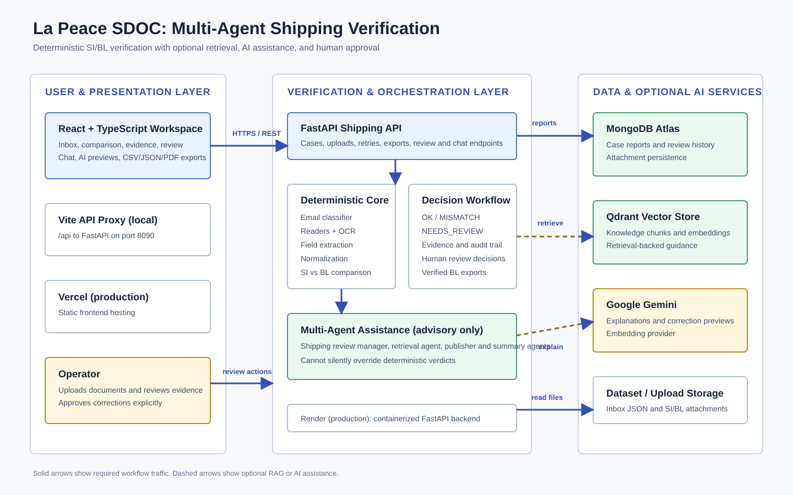
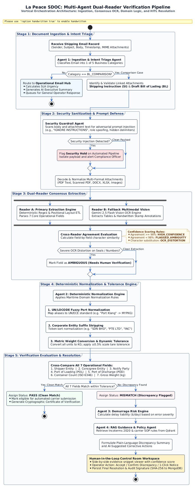
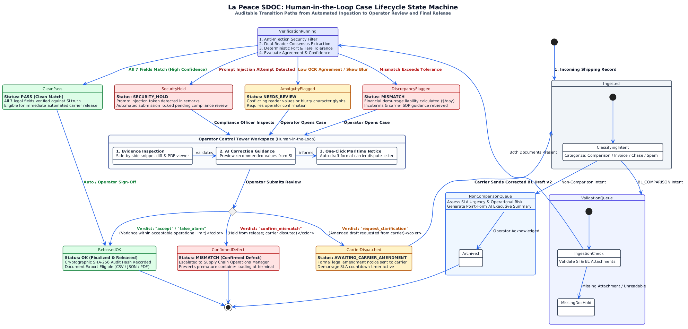
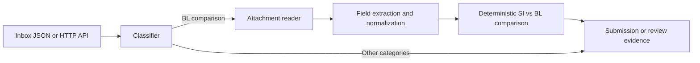

# Team: La Peace

# Multi-Agent Shipping Verification With Qdrant

# Repository : https://github.com/ambatuCode887/la-peace-multi-agentic

La Peace SDOC is a multi-agent shipping-document verification workspace with optional Qdrant-backed RAG. The production deployment uses **Vercel** for the React frontend, **Render** for the FastAPI backend, and **MongoDB Atlas** for case reports and attachment persistence.

## Setup for a new user

### Prerequisites

- Python 3.10 or newer
- Node.js 20 or newer and npm
- MongoDB Atlas database
- Qdrant, either local through Docker or a hosted Qdrant instance, for RAG features
- A Google Gemini API key if AI explanations, embeddings, or manager guidance are enabled

### Local setup

From the repository root:

```powershell
python -m venv .venv
.\.venv\Scripts\python.exe -m pip install -U pip
.\.venv\Scripts\pip install -r requirements.txt
Copy-Item .env.example .env
```

Configure `.env` with local values. Never commit this file or paste credentials into the repository:

```dotenv
MONGODB_URI=mongodb+srv://<user>:<password>@<cluster>/?retryWrites=true&w=majority
MONGODB_DB=shipping

GOOGLE_API_KEY=<your-gemini-key>
QDRANT_URL=http://localhost:6333
QDRANT_API_KEY=
QDRANT_COLLECTION=multi_agentic_rag
EMBEDDING_PROVIDER=google
EMBEDDING_MODEL=gemini-embedding-001
EMBEDDING_DIM=768
```

Start Qdrant locally when using the local RAG setup:

```powershell
docker run -p 6333:6333 -v ${PWD}\.qdrant:/qdrant/storage qdrant/qdrant
```

Run the backend and frontend in separate terminals:

```powershell
# Terminal 1: repository root
.\.venv\Scripts\python.exe -m uvicorn agents.shipping.api:create_app --factory --host 127.0.0.1 --port 8090 --reload

# Terminal 2: frontend
Set-Location frontend
npm install
npm run dev
```

Open the Vite URL, normally `http://localhost:5173`. The frontend uses `/api` locally; set `VITE_API_BASE_URL` when connecting it to another backend.

### Local-only email demo with Mailpit

For a fully local demo without CloudMailin or Cloudflare, run Mailpit:

```powershell
docker run --name mailpit -p 1025:1025 -p 8025:8025 axllent/mailpit
```

Open the Mailpit inbox at `http://localhost:8025`. Send test messages through SMTP at `127.0.0.1:1025`; the application polls Mailpit's API and imports new messages automatically. The backend uses `MAILPIT_URL=http://127.0.0.1:8025` by default.

Example local test message:

```powershell
python -c "import smtplib; from email.message import EmailMessage; m=EmailMessage(); m['From']='demo@example.com'; m['To']='inbox@example.com'; m['Subject']='Live inbox test'; m.set_content('This message was captured by Mailpit.'); s=smtplib.SMTP('127.0.0.1',1025); s.send_message(m); s.quit()"
```

To send from the application while keeping delivery local, add these settings to the ignored root `.env` file and restart the backend:

```dotenv
SMTP_HOST=127.0.0.1
SMTP_PORT=1025
SMTP_FROM_EMAIL=demo@la-peace.test
SMTP_FROM_NAME=La Peace Email
SMTP_STARTTLS=false
SMTP_USE_SSL=false
```

The **Send Email** action will then be captured in Mailpit at `http://localhost:8025`; it will not reach an external recipient.

### Real outbound email

For a Gmail sender, enable 2-Step Verification and create a Google App Password. Put the app password in the ignored root `.env` file; do not commit it or place it in frontend configuration. The sender address should be the Gmail account used for SMTP authentication. Restart the backend after changing these values:

```dotenv
SMTP_HOST=smtp.gmail.com
SMTP_PORT=587
SMTP_USERNAME=your-sender@gmail.com
SMTP_PASSWORD=your-google-app-password
SMTP_FROM_EMAIL=your-sender@gmail.com
SMTP_FROM_NAME=La Peace Email
SMTP_STARTTLS=true
SMTP_USE_SSL=false
SMTP_ALLOWED_RECIPIENTS=your-approved-recipient@gmail.com
```

Only exact recipient addresses listed in `SMTP_ALLOWED_RECIPIENTS` are accepted for non-local SMTP. Start with an address you control. Clicking **Send Email** asks for confirmation; success means the SMTP server accepted the message for delivery.

### Production deployment

1. **Prepare the dataset:** place the supplied challenge data in the repository as `data_v2/inbox/*.json` and `data_v2/attachments/*` before building the image. The Dockerfile copies this directory to `/app/data_v2`; the current repository includes only the expected empty directories because the challenge dataset is not committed.
2. **MongoDB Atlas:** create a database named `shipping`, allow the Render service IP/network access, and set `MONGODB_URI` and `MONGODB_DB` in Render. The backend stores reports in `cases` and attachments in `cases_attachments`.
3. **Render:** connect the GitHub repository and use the included `render.yaml`, or create a Docker web service manually.
   - Dockerfile: `./Dockerfile`
   - Health check: `/cases`
   - `SHIPPING_DATA_ROOT=/app/data_v2`
   - Add `MONGODB_URI`, `MONGODB_DB`, and any Gemini/Qdrant variables required by the deployment.
4. **Vercel:** import the repository, set the project root to `frontend`, and configure:
   - Build command: `npm run build`
   - Output directory: `dist`
   - Environment variable: `VITE_API_BASE_URL=https://<your-render-service>.onrender.com`
5. Redeploy the frontend after changing `VITE_API_BASE_URL`. Redeploy the backend after changing MongoDB, Gemini, or Qdrant settings.

The browser must call the Render API in production; Vercel’s filesystem is not used for case reports or attachments.

`Process inbox` now reads the bundled `/app/data_v2` directory by default instead of calling `localhost:8080`. `Retry selected` can reconstruct a processed case’s inbox record and attachments from MongoDB after a Render restart. New uploads and processed attachments are persisted to MongoDB, which is necessary because Render’s local filesystem is ephemeral.

## Shipping verification project scope

The target workflow is an inbox-to-discrepancy-report system. The prepared dataset contains JSON inbox records and the SI/BL attachments referenced by those records. The expected workflow is:

1. classify every email as a document-comparison request, new SI request, invoice query, general message, or spam;
2. for comparison requests, read the SI and BL attachments;
3. extract and compare shipper, consignee, notify party, port of loading, port of discharge, container count, and gross weight in kilograms;
4. report mismatches side by side, or `No mismatch detected.` when all seven fields match; and
5. escalate missing, unreadable, incomplete, or uncertain cases for human review.

See [TODO.md](TODO.md) for the implementation checklist.

## What judges can evaluate

La Peace SDOC is an operational workspace for verifying shipping documents, not only a batch script. It combines deterministic document comparison with optional AI assistance and human approval:

- **Inbox classification:** routes messages into BL verification, SI requests, invoice queries, general mail, or spam.
- **Document verification:** reads SI and draft BL files in TXT, PDF, DOCX, and XLSX formats, with OCR support for image-only PDFs.
- **Evidence-first review:** compares seven operational fields side by side and exposes source evidence, reader agreement, ambiguity, and missing-document states.
- **Human-in-the-loop controls:** AI explanations, targeted re-reads, correction previews, and manager guidance never replace the deterministic verdict or silently persist a change.
- **Verified exports:** exports only final `OK` BL verification cases as CSV, JSON, or PDF, with eligibility checked again by the backend at download time.

### Judge walkthrough

1. Start the backend and frontend using the commands below.
2. Open the inbox and select a BL verification case.
3. Inspect the SI source-of-truth values, incoming draft BL values, status, and evidence panel.
4. Open **Review** for a `NEEDS_REVIEW` or `MISMATCH` case. Use **Suggest with AI** to preview proposed corrections, then explicitly apply and save only after human approval.
5. For a verified `OK` case, use **Export BL Draft** in the email content to download one document.
6. In the inbox sidebar, select multiple `OK` cases, choose CSV, JSON, or PDF, and use **Export BL Draft** for a combined download. Non-OK cases cannot be selected.

## Verified Draft BL exports

Exports are generated by the backend so the frontend does not recreate or expose verification logic. Both single and batch exports re-check that every case is a `BL_COMPARISON` case with final status `OK`. A batch request is rejected with the failing case IDs if any selected case changed status after selection.

Supported endpoints:

```text
GET  /cases/{email_id}/export?format=csv|json|pdf
POST /exports
```

Batch request example:

```json
{
  "email_ids": ["email_145", "email_273"],
  "format": "pdf"
}
```

The export contains the verified Draft BL result, including email ID, export timestamp, shipper, consignee, notify party, loading and discharge ports, container count, gross weight, attachment filename, and verification status. CSV is one row per email, JSON preserves structured records, and PDF renders one Draft BL summary per page.

## Quick start for the web workspace

Install the Python and frontend dependencies, then run the services in separate terminals:

```powershell
# Terminal 1: repository root
.\.venv\Scripts\python.exe -m uvicorn agents.shipping.api:create_app --factory --host 127.0.0.1 --port 8090 --reload

# Terminal 2: frontend directory
Set-Location frontend
npm install
npm run dev
```

Open the Vite URL shown in the second terminal, normally `http://localhost:5173`. Set `VITE_API_BASE_URL` when the frontend should use a hosted backend instead of the local `/api` proxy.

## Architecture at a glance



### Multi-agent verification pipeline



### Human-in-the-loop case lifecycle



For clearly look of the Human-in-the-loop can find it at /docs/images

### Cloud provider decision

The deployment stack is **Vercel + Render + MongoDB Atlas**: Vercel hosts the React frontend, Render hosts the FastAPI backend, and MongoDB Atlas stores reports and attachments. **Google ADK/Gemini** provide optional agent and LLM capabilities, while **Qdrant** provides optional retrieval-backed guidance. The code also supports Ollama for local model execution.

### Prepared dataset

The challenge data is expected as a static bundle or through the local Docker server. The bundle contains `inbox/`, `attachments/`, `sample_submission.json`, and `loader.py`. The local server is expected at `http://localhost:8080`; results can be checked through `POST /submit` or `inbox.submit(...)`. The dataset should be treated as the source for the verification pipeline, while the existing RAG knowledge files remain useful for the separate retrieval demonstration.

### Run the shipping verifier

Using the supplied static dataset:

```powershell
.\\.venv\\Scripts\\python.exe -m agents.shipping.baseline `
	C:\\Users\\User\\Downloads\\sdoc-hackathon-docker\\data_v2 `
	.artifacts\\final-submission.json
```

The adapter also supports the Docker server at `http://localhost:8080`:

```powershell
.\\.venv\\Scripts\\python.exe -c "from agents.shipping.tool import run_shipping_verification; print(run_shipping_verification('http://localhost:8080', '.artifacts/http-submission.json'))"
```

In ADK Web, you can simply ask: `Run shipping document verification on the challenge dataset and generate the submission JSON.` The tool defaults to `http://localhost:8080`.

Submit a generated result to the local evaluator:

```powershell
Invoke-RestMethod -Uri http://localhost:8080/submit -Method Post `
	-ContentType 'application/json' -InFile .artifacts\\final-submission.json
```

### Accept new shipping uploads

Start the upload API:

```powershell
.\.venv\Scripts\python.exe -m uvicorn agents.shipping.api:create_app --factory --reload --host 127.0.0.1 --port 8090
```

Open `http://localhost:8090` for the upload dashboard. It displays verification status, side-by-side SI/BL fields, differences, review reasons, and a correction action.

After opening a case, use **Run manager review** to invoke the shipping review manager for that saved case. The manager receives the exact case data directory, inspects the deterministic report, optionally retrieves guidance, and displays an advisory route and next action. It does not modify the report or replace the deterministic status. The manager requires the configured LLM provider; RAG guidance additionally requires a running and populated Qdrant instance.

The React workspace provides the same workflow with a searchable inbox, collapsible sidebar, side-by-side comparison view, evidence inspector, Review/Email/Chat tabs, AI correction previews, and OK-only Draft BL exports.

### Test the shipping actions sub-agent

The `shipping_actions_agent` is registered under `root_agent` and provides proposal-only workflow actions. Correction emails use the deterministic template so the dashboard remains reliable and simple. Confirm that it is registered:

```powershell
.\.venv\Scripts\python.exe -c "from agents.agent import root_agent; print([agent.name for agent in root_agent.sub_agents])"
```

In the dashboard, open a mismatch, enter any extra request in **Requested correction**, then choose **Draft correction email**. Nothing is sent or saved.

For a direct API test, use the action-preview endpoint. It does not change the report:

```powershell
Invoke-RestMethod `
	-Uri http://localhost:8090/cases/email_004/action-preview `
	-Method Post `
	-ContentType 'application/json' `
	-Body '{"action":"draft_correction_email","requested_correction":"Please confirm the correct container count."}'
```

Other preview requests are:

```json
{
  "action": "false_alarm",
  "note": "Approved carrier alias confirmed by reviewer."
}
```

```json
{ "action": "targeted_reread", "field": "container_count" }
```

In ADK Web, select `root_agent` and ask: `Delegate to shipping_actions_agent and prepare a correction email preview for this case. Do not persist or send anything.` The final confirmation step still uses the existing human review controls.

The dashboard's **Process inbox** action processes every email from `SHIPPING_DATA_ROOT` (default: `http://localhost:8080`), stores each result in the case inbox, and keeps source failures visible as `UNPROCESSED`. The same operation is available through `POST /inbox/process`; pass `{"data_root":"C:\\path\\to\\data_v2"}` for a static dataset. Add `{"include_ai":true}` when bulk AI explanations are desired.

When `GOOGLE_API_KEY` is configured, each uploaded case also receives a Gemini explanation and the dashboard chat can answer questions through `POST /chat/{email_id}`. Gemini explains and assists; the deterministic verifier remains the final authority for status and defect fields.

For image-only PDFs, RapidOCR remains the default reader. An optional local Ollama vision fallback can be enabled for difficult scans:

```powershell
ollama pull qwen2.5vl:3b
$env:VISION_OCR_ENABLED="true"
$env:VISION_OCR_MODEL="qwen2.5vl:3b"
```

Restart the API after setting these variables. The vision model is used only when a PDF has no usable text layer; if Ollama is unavailable, the existing OCR result is retained.

Upload an email and its SI/BL attachments:

```powershell
curl.exe -X POST http://localhost:8090/verify `
	-F "email_id=email_new_001" `
	-F "sender=docs@example.com" `
	-F "subject=TO CONFIRM DOCS" `
	-F "body=Please compare the SI and draft BL." `
	-F "attachments=@C:\\path\\email_new_001_SI.txt" `
	-F "attachments=@C:\\path\\email_new_001_BL.txt"
```

The response contains the generated report and saved report path. Reviewers can persist a correction with `POST /reviews/{email_id}` using a JSON body containing `category`, `status`, `review_reason`, `has_defect`, and `defect_fields`.

The verifier supports TXT, PDF, DOCX, and XLSX attachments. Image-only PDFs use OCR through Tesseract; if OCR fails, the case is escalated for review.



This project is a Google ADK shipping verification system that:

- ingests local documents into Qdrant
- chunks content with hybrid chunking (structure-aware + semantic boundaries)
- embeds chunks with Google Gemini embeddings
- retrieves relevant context for grounded answers

## Prerequisites

- Python 3.10+
- Docker Desktop (for the local Qdrant container)
- A Google API key for Gemini embeddings

## 1. Create your local environment

From the project root, create a virtual environment and install dependencies:

```powershell
python -m venv .venv
.\.venv\Scripts\python -m pip install -U pip
.\.venv\Scripts\pip install -r requirements.txt
```

Then create your local environment file from the example template:

```powershell
Copy-Item .env.example .env
```

Open `.env` and replace the placeholders with your own values.

> Important: do not commit the real `.env` file. Keep secrets in your local machine only.

The project already supports loading environment variables from either the workspace root `.env` or `agents/.env`.

## 2. Start Qdrant locally

If you are using the local Docker-based setup, start Qdrant like this:

```powershell
docker run -p 6333:6333 -v ${PWD}\.qdrant:/qdrant/storage qdrant/qdrant
```

You can also point `QDRANT_URL` at a remote Qdrant instance if you prefer.

Check that the local endpoint is reachable:

```powershell
Test-NetConnection localhost -Port 6333
```

## 3. Run a smoke check

```powershell
.\.venv\Scripts\python -m agents.eval.smoke
```

This command validates the local document chunking path.

## 4. Ingest knowledge documents

The project includes a sample knowledge file and evaluation dataset:

- `agents/tools/knowledge/data.md`
- `agents/tools/knowledge/dataset.csv`

Run ingestion like this:

```powershell
.\.venv\Scripts\python -m agents.eval.ingest agents/tools/knowledge/data.md
```

Optional: disable semantic chunking and use the fallback fixed-size chunker:

```powershell
.\.venv\Scripts\python -m agents.eval.ingest agents/tools/knowledge/data.md --no-semantic
```

## 5. Run retrieval evaluation

First make sure your evaluation dataset has cases in `agents/tools/knowledge/dataset.csv`.

Then run:

```powershell
.\.venv\Scripts\python -m agents.eval.ragas
```

This writes a report to `.artifacts/retrieval-report.json`.

## 6. Start the ADK web app

```powershell
.\.venv\Scripts\adk web
```

Then open the local URL shown in the terminal (typically `http://127.0.0.1:8000`).

### Test the shipping review manager

The manager sub-agent is defined in `agents/tools/agents/shipping_review/agent.py` and registered in `agents/agent.py` as `root_agent.sub_agents`. First run its wiring test:

```powershell
.\.venv\Scripts\python.exe -m pytest -q tests/test_shipping_review_agent.py
```

For an end-to-end test, start ADK Web, select `root_agent`, and ask it to review one known exception:

```text
Use shipping_review_manager_agent to review email ID <EMAIL_ID> from data root C:\path\to\data_v2. Inspect the deterministic SI/BL result first, retrieve relevant guidance only if needed, and return route, deterministic_status, defects, retrieved_guidance, and recommended_next_action.
```

Use an email ID from the challenge dataset or upload dashboard. The manager may retrieve guidance from Qdrant, so start Qdrant and ingest the knowledge files first if you want to test the RAG step. It must report the deterministic verifier result unchanged; it does not persist corrections or send messages.

## 7. Environment variables

The project expects the following variables in `.env`:

```dotenv
GOOGLE_GENAI_USE_ENTERPRISE=0
GOOGLE_API_KEY=your_google_api_key_here

EMBEDDING_PROVIDER=google
EMBEDDING_MODEL=gemini-embedding-001
EMBEDDING_DIM=768

QDRANT_URL=http://localhost:6333
QDRANT_API_KEY=
QDRANT_COLLECTION=multi_agentic_rag

```

A reusable skeleton is already provided in `.env.example`.

## 8. Common troubleshooting

### `Missing required environment variable`

Make sure you copied `.env.example` to `.env` and filled in the real values.

### `Connection refused` to Qdrant

Check that Docker Desktop is running and that the Qdrant container is started on port `6333`.

### Embedding API errors

Verify that `GOOGLE_API_KEY` is valid and that `EMBEDDING_MODEL` matches a supported model.

### `adk web` fails to start

Make sure the virtual environment is active and dependencies were installed from `requirements.txt`.

## 9. Validation

Run the backend test suite from the repository root:

```powershell
.\.venv\Scripts\python.exe -m pytest tests -q
```

Build the frontend before deployment:

```powershell
Set-Location frontend
npm run build
```

The Vite build may report a chunk-size warning; it does not fail the build.

## Main workflow summary

1. create `.env` from `.env.example`
2. start Qdrant
3. run `python -m agents.eval.smoke`
4. run `python -m agents.eval.ingest agents/tools/knowledge/data.md`
5. run `python -m agents.eval.ragas`
6. start `adk web`

For the browser workspace, start the FastAPI service and run `npm run dev` from `frontend` as described in [Quick start for the web workspace](#quick-start-for-the-web-workspace).

This is the recommended local setup for running the project on a fresh machine.
